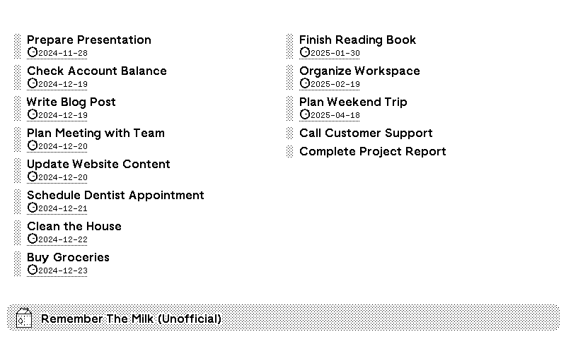

# TRMNL Task Integration Plugin

An unofficial plugin to integrate tasks from a specific list in Remember The Milk into TRMNL.



## Details
This plugin fetches tasks from a specified list in Remember The Milk and sends them to TRMNL, 
displaying them on an e-ink screen.

## Requirements
This code interacts with both the RTM REST API using 'milkman' gem and the TRMNL webhook API. 
You will need to host and execute the code yourself to periodically push updated task data from RTM to TRMNL.

## Setup
1. In TRMNL, navigate to **Plugins -> Private Plugin -> Add New**. Assign it a name and select "Webhook" as the strategy. Save the settings.
2. Copy the contents of ``template.html.liquid`` and paste it into the markup section of your TRMNL plugin.
3. Copy the Plugin UUID and your TRMNL API key.
4. Download the code and rename the ``.env_template`` file to ``.env``. Then populate it as follows:
```
TRMNL_API_KEY=<your api key>
TRMNL_PLUGIN_ID=<your plugin UUID>
RTM_API_KEY=<your rtm api key>
RTM_SHARED_SECRET=<your rtm api key>
RTM_LIST=<name of a list to fetch>
```

To obtain your RTM API key and shared secret go to https://www.rememberthemilk.com/services/api/requestkey.rtm

5. Run ``bundle``
6. Getting RTM authorization token:

   - Run the `milkman` executable

       ```milkman authorize API_KEY SHARED_SECRET```

   - You will see something similar to this:

       > Copy the URL below and follow the steps on Remember The Milk (RTM) to authorize Milkman:
       > https://www.rememberthemilk.com/services/auth/?api_key=API_KEY&perms=read&format=json&v=2&api_sig=08da0d11ef239318027364133ac1a644
       > Once you've authorized Milkman, you'll receive a hash called 'frob' from Remember The Milk. The page from Remember The Milk will list something like the following: 'No callback URL specified for this API key. Your frob value is YOUR_FROB'. Copy and paste that YOUR_FROB value below and press <enter>:

   - Copy the provided URL and open it in your browser.

   - Retrieve the 'frob' code from the Remember The Milk website, then enter it into your command line interface and press enter.

    - After completing these steps, you'll obtain the authentication token from Remember The Milk:

    > USERNAME, you've successfully authorized Milkman with Remember The Milk. As you can see we've received your username and an authorization token. Both this auth token, your API key and shared secret should be saved for later use. You can either save them in a YAML file and load them in your application, include them in the Ruby script where you're using this gem or set them as environment variables. That's completely up to you.
    > Both the auth token, API key and shared secret are listed below. Save them using one of the methods above (or perhaps another solution) as you'll need all of them to use Milkman in your own project. Oh, and Remember... The Milk!
    
    >     api_key:       API_KEY
	>     shared_secret: SHARED_SECRET
	>     auth_token:    AUTH_TOKEN

    - add/edit following line to .env file:
    ```
    RTM_AUTH_TOKEN=<your rtm auth token>
    ```

5. Run ``main.rb``. If it successfully posts data to TRMNL, you are all set. You can refresh the TRMNL interface to check if the data is visible.

To keep the data updated, you can schedule the script to run at regular intervals according to your needs.

## Disclaimer

This plugin is an unofficial non-commercial project and is not endorsed or certified by Remember The Milk.

This work has been heavily inspired by a plugin written for the TODOIST app by Nynir, 
available at https://github.com/Nynir/trmnl-todoist.

Please note that "Remember The Milk" and related trademarks are the property
of their respective owners. Using this plugin does not grant any rights to these trademarks, 
nor does it imply any association with or endorsement by the trademark owners.


### Links

- https://help.usetrmnl.com/en/articles/9510536-private-plugins
- https://usetrmnl.com/framework
- https://github.com/Shopify/liquid
- https://github.com/usetrmnl/plugins
- https://docs.usetrmnl.com/go/private-plugins/create-a-screen
- https://www.rememberthemilk.com/services/api/
- https://github.com/kevintuhumury/milkman
- https://github.com/Nynir/trmnl-todoist
- https://github.com/eindpunt/awesome-TRMNL

### Check out my other private TRMNL plugins.
- https://github.com/sejtenik?tab=repositories&q=trmnl-